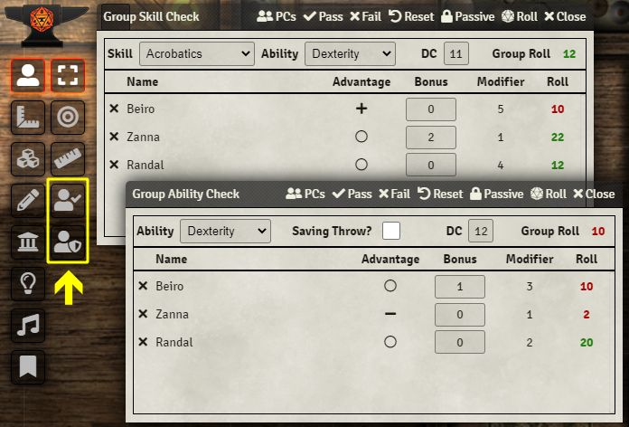
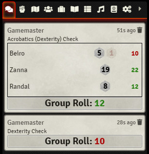
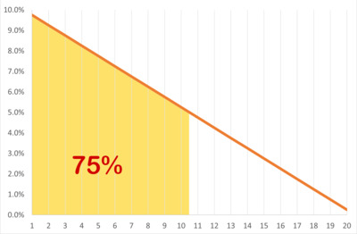
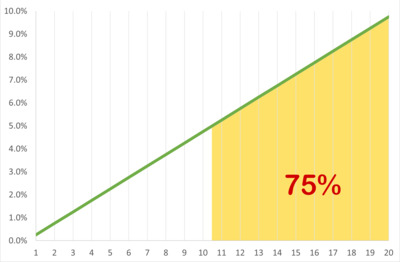
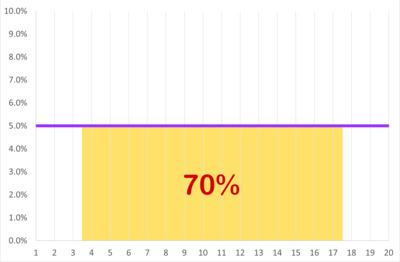
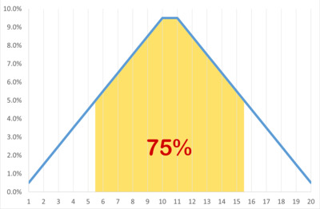
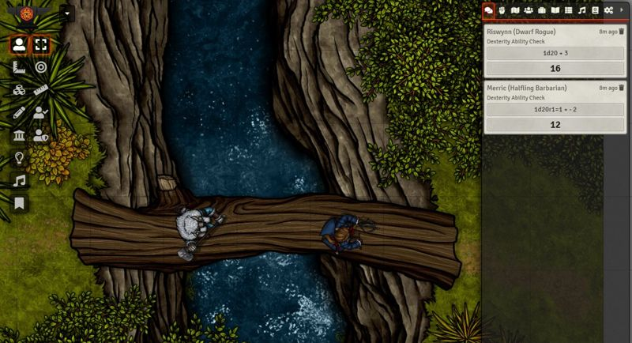
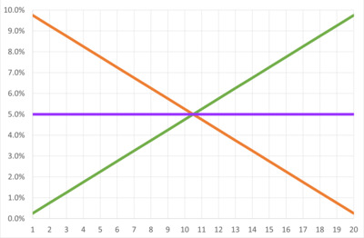
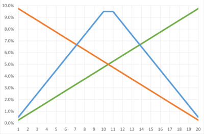
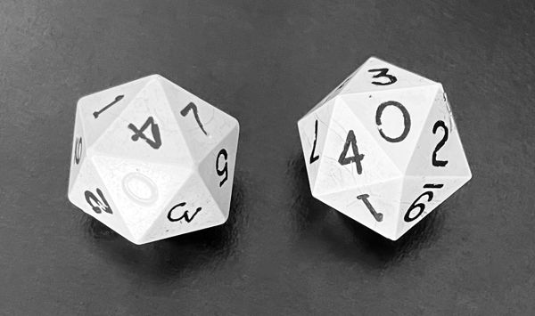

# Group Rolls for D&D 5e

The primary purpose of this module is to facilitate group ability and skill check rolls per the D&D 5e Player's Handbook, page 175: *"If at least half the group succeeds, the whole group succeeds."*  It also displays the rolls for each individual token, and therefore can be used to roll individual saving throws for an entire groups of tokens at once. It was not intended to be used to automate combat.  There are far better tools for that, such as [midi-QoL](https://foundryvtt.com/packages/midi-qol).  However, a new feature (not yet illustrated here) lets you apply a fixed amount of damage or healing to all tokens in the list.

## Launching the Application and Selecting Tokens

The module adds two buttons to the Token menu on the left of the canvas. Group skill and ability checks can be launched by selecting tokens, then clicking the relevant group roll button. The window can be left open, and it will update automatically if the token selection is changed.  The "PCs" button will select all player character tokens on the canvas.  Individual tokens can be deselected by clicking the "x" next to the token name.  Double-clicking a token's name opens the token's character sheet.

The "Pass" button toggles the display between all selected tokens or only those tokens with successful rolls, while the "Fail" button toggles the display between all selected tokens or only those tokens with failed rolls.  A new feature (not yet shown in the illustration below) lets you apply a fixed amount of damage or healing to all tokens currently displayed in the dialog.  So to apply the same amount of damage to all tokens that failed a saving throw, for example, click the "Fail" button to display on those tokens that failed their roll, then enter the amount of damage and click the apply damage button.

## Selecting Roll Options

Skills and abilities are selected from the dropdowns.  If desired, the DC for the roll can be entered.  A successful roll is colored green, while a failed roll is colored red.

Advantage, disadvantage, and situational bonuses can be set individually for each token.  The "Reset" button clears advantage, bonuses, and rolls for all tokens.  The "Roll" button rolls for all tokens at once, taking into account all advantage and bonus settings, then calculates the minimum roll achieved by at least half of the group.

Finally, there is a "Passive" button to run passive skill or ability checks for a group in place of actual rolls.  

## Displaying the Results

Normally, roll results are only displayed in the Group Roll application window, which is only visible to the GM.  However, if the GM holds down the "Shift" key while clicking the Roll button, the results of the new roll will also be displayed in the Chat Log, where they are visible to both the GM and the players, or to just the GM, depending on whether "Public Roll" or "Private GM Roll" is selected as the roll mode in the Chat Log. This behavior can be inverted in the module configuration settings.  If the GM holds down the "Ctrl" key while clicking the Roll button, the results of the previous roll will be retained.  That means that holding down "Ctrl-Shift" while clicking the Roll button displays the previous roll results in the Chat Log without rolling new rolls.  As shown below, clicking on the Group Roll result bar in the Chat Log reveals the details for each token's rolls.  Passive checks cannot be output to the Chat Log since they are not actual rolls.

## Additional Options

The module also has the following configuration options:

1. Output roll results as PASS/FAIL checkmark icons instead of numbers.
2. Output roll results to the Chat log automatically. If the GM holds down the "Shift" key while clicking the Roll button, output to the Chat log is suppressed. Setting this option to True reverses the normal behavior for displaying roll results in the Chat log, as described in the previous section.
3. Enable integration with Dice So Nice, if that module is installed.
4. Enable a house rule to treat natural 20 or 1 as critical sucess or failure (this is not RAW).
5. Enable a personal house rule of mine that uses the average of 2d20 in place of normal 1d20 rolls (detailed explanation below).

All of these options are disabled by default, but they can be individually enabled in the module configuration settings.

## System Compatibility

This module was designed for the D&D 5e system. The module also provides limited support for certain group rolls in older versions of the Pathfinder 2e system. Unfortunately, due to major changes to the data structure in the PF2e system, support for the current version of that system had to be dropped.

## License

This Foundry VTT module, written by trdischat with major assistance from Atropos, 
ayan, KaKaRoTo, and cs96and is licensed under a [Creative Commons Attribution 4.0 International License](http://creativecommons.org/licenses/by/4.0/).

# Appendix: Why Average Normal Rolls?

As the author of this module, I suspect that I am the only person who has ever been interested in using the option to average two d20 in place of a standard 1d20 roll for checks and saves. So I clearly labelled it in the module as a personal house rule that you can safely ignore. That said, it occurred to me that someone out there might be vaguely curious as to why I created this rule in the first place. So here is the explanation for the rule and why I like it.

One of my long-time fascinations with D&D and similar games is the statistics underlying the use of dice in the game, and the ways in which those statistics influence game dynamics. The d20 roll is the most fundamental mechanism in D&D. It provides that very important element of chance to the outcome of most situations in the game. Counter-balancing the randomness of the dice are the character's fundamental abilities, skill proficiencies, and various bonuses, all of which adjust the probabilities of the d20 roll in ways that help drive the narrative in the game. On top of that you have the mechanism of advantage and disadvantage rolls, which take either the higher or the lower of two d20 rolls to adjust the probabilities of success up or down, mostly to reflect circumstances in the game that warrant tilting the odds.

When it comes to skill checks, ability checks, and saving throws, my general impression has been  that chance might be playing slightly too big a role in the outcome. If two characters with different DEX scores are asked to make a Stealth check, I would argue that the character with higher dexterity should have a bigger advantage than is currently the case when rolling 1d20. When players roll checks against a challenge with a static DC, each point of bonus increases the odds of success by a fixed 5%. In contrast, those bonus points have a bigger impact on the odds when rolling with advantage or disadvantage. The same is true of contested rolls, since the relative bonus of each party factors into the odds.

The key difference between normal 1d20 rolls and rolling with either advantage or disadvantage is that a single die produces a completely flat distribution of results, while two or more dice create a distribution of probabilities that is skewed in a particular direction. As you add more dice to the roll, the distribution of outcomes approaches the so-called "normal" distribution. As shown in the charts below, advantage and disadvantage rolls are strongly skewed to the top or bottom of the range of outcomes, with 75% of the results of an advantage roll falling between 11-20, and 75% of the results of a disadvantage roll falling between 1-10. In contrast, a standard 1d20 roll yields a completely flat distribution with no particular direction to it. I realized that if I used the average of two d20 rolls in place of a single d20, the distribution had a strong bias towards the middle of the range, with 75% of the results falling between 6-15.

|Disadvantage Roll (2d20kl)|Advantage Roll (2d20kh)|
|:----:|:----:|
|||
|75% between 1 and 10|75% between 11 and 20|

|Standard Roll (1d20)|Average Roll (2d10-1dc)|
|:----:|:----:|
|||
|70% between 4 and 17|75% between 6 and 15|

The implication of using an average of 2d20 is that a character with a +1 bonus will have a 9.5% higher chance of success, compared to a 5% improvement using a standard 1d20 roll. This means that ability scores and other bonuses have a stronger impact on the odds of success, which I feel is an improvement in the balance between random chance and comparing static scores. It makes that extra +1 to DEX a little bit more important to the outcome, which means that the differences in the characters' abilities ultimately has a bigger impact on the narrative. For example, assume that a Rogue with a DEX of 16 and a Barbarian with a DEX of 7 attempt to walk across a slippery log over a treacherous ravine, requiring a DEX check with a DC of 14. The Rogue has +3 on the roll, effectively reducing the DC to 11, while the Barbarian rolls at -2, effectively increasing the DC to 16. Under the rules as written, the Rogue has a 50% chance of success, while the Barbarian has only a 25% chance of success. I would argue that the nimble Rogue's odds of success should be more than double that of the clumsy Barbarian. Using the average of 2d20, the Rogue's odds are still 50%, but the Barbarian's chances of success are now only 12.5%, making the Rogue four times more likely to succeed. I feel that this helps the narrative by making the differences in the characters' DEX scores more relevant, while still retaining the element of chance in the outcome. Oops! Looks like the Barbarian is going for a swim.

I should note that I personally decided not to use the average of 2d20 for attack rolls. The reason for this different treatment is that combat is inherently more chaotic, and crits and fumbles are an important part of the drama of combat. Using the average of 2d20 for attack rolls would reduce the odds of rolling a crit or a fumble from 5% down to a mere 0.5%. I am not a big fan of automatic success or failure on checks and saves, and thus don't mind this lower probability of rolling a 1 or a 20 when applied to skill and ability rolls.  So my personal choice is to use average rolls for checks and saves, but traditional 1d20 rolls for normal attack rolls.

In closing, it needs to be said that this rule can be a bit challenging to use if you are rolling physical dice. There are lots of ways to do it. I started off by rolling two d20 and computing the average roll as `ROUNDUP(1d20/2)+ROUNDDOWN(1d20/2)`. I found that trying to do this in my head while rolling actual dice was painful. I then realized that the you could get the exact same probabilities by rolling 2d10 and subtracting a coin flip (heads is 1, tails is 0). Even this requires a bit too much mental gymnastics when rolling actual dice. So my current approach is to compute the average in Foundry using a roll of `2d10-1dc`. Having a computer do all the math for you in the background is pretty nice. And that is ultimately why I included it for my own use in this module.

|Rules as Written|My House Rules|
|:----:|:----:|
|||

POSTSCRIPT: I subsequently hit upon a fairly elegant way to roll averages with physical dice using two old-school d20s that are numbered 0-9 twice. Just leave a single zero on one of the two dice uninked. Treat all three of the inked zeros as 10, but treat the single uninked zero as a true 0. Now roll both dice as 2d10, add the results of the two dice, with inked zeros counting as 10 and the single uninked zero treated as 0 (i.e., ignore it). The example roll below is 14. If instead we rolled the uninked zero from the left die and the four on the right die, the result would be 4 rather than 14.  Having a single 0 and a single 10 on the left die yields the exact same result as subtracting a coin flip from 1d10. The beauty of this method is that you just add the two dice; no mental gymnastics required!

For those of you who made it this far, thanks for listening.
